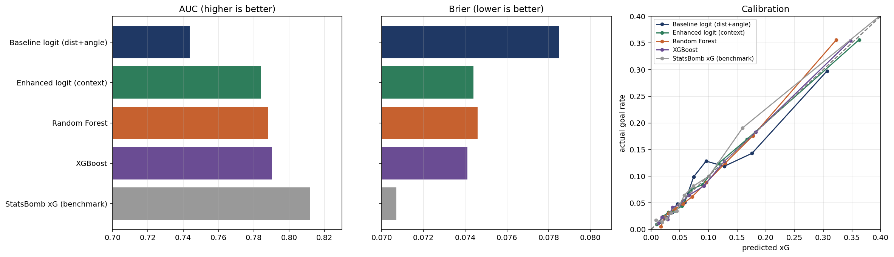
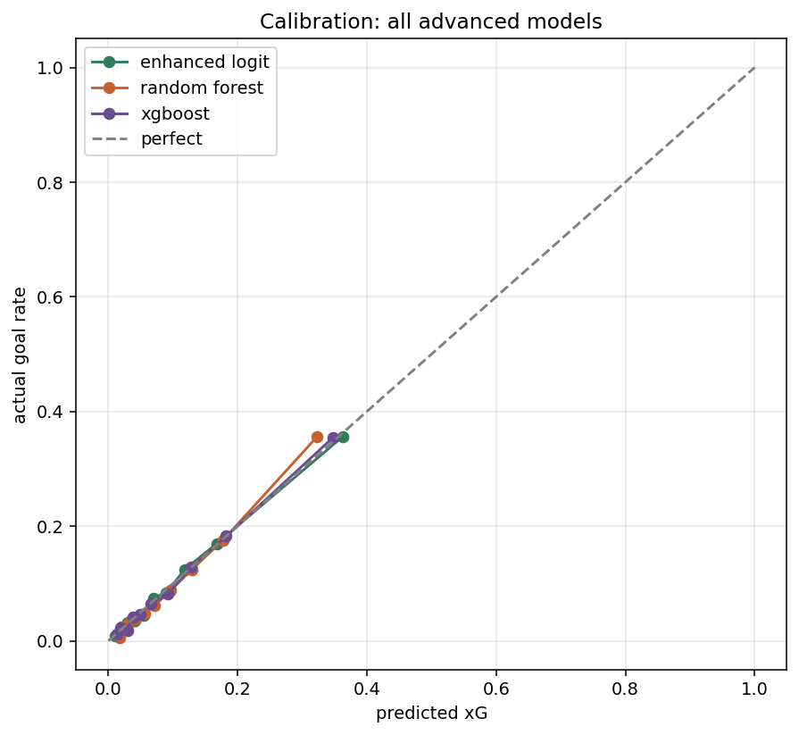
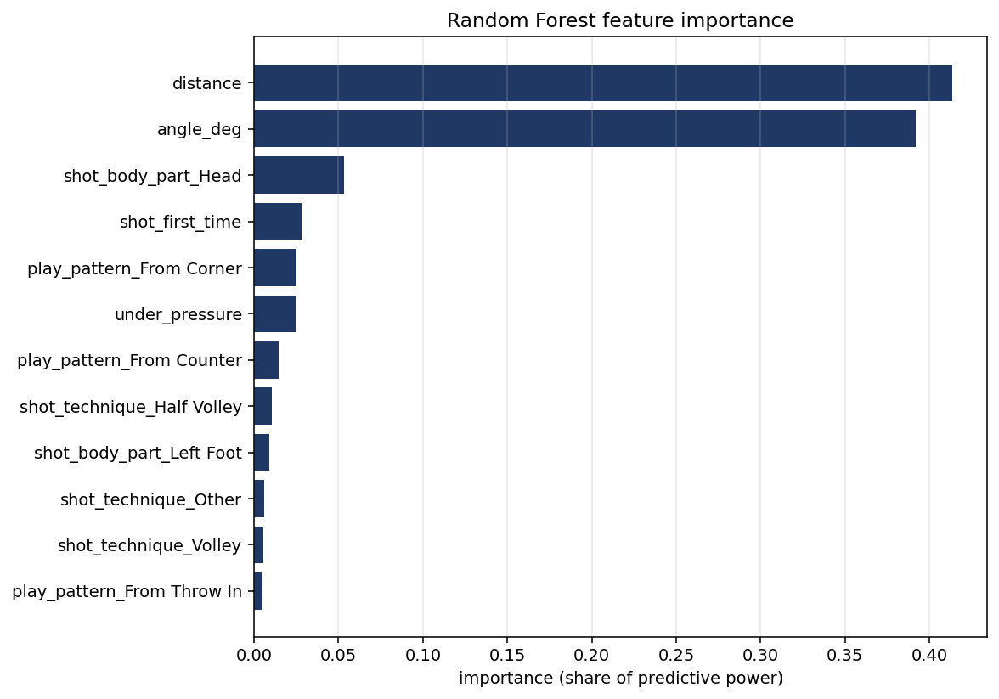
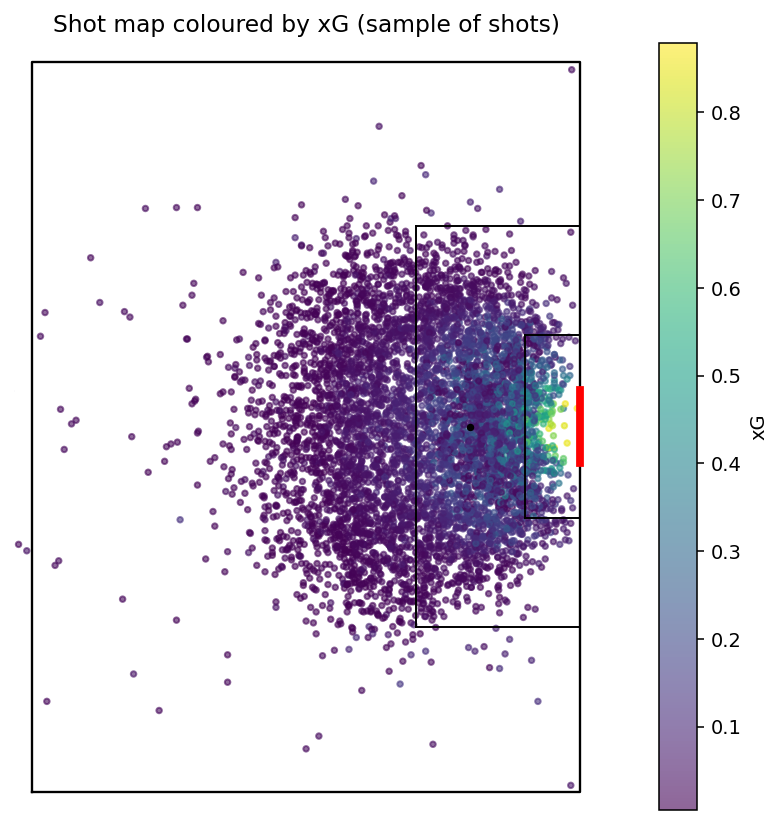
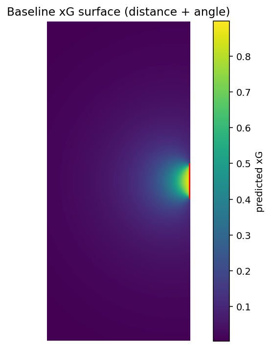
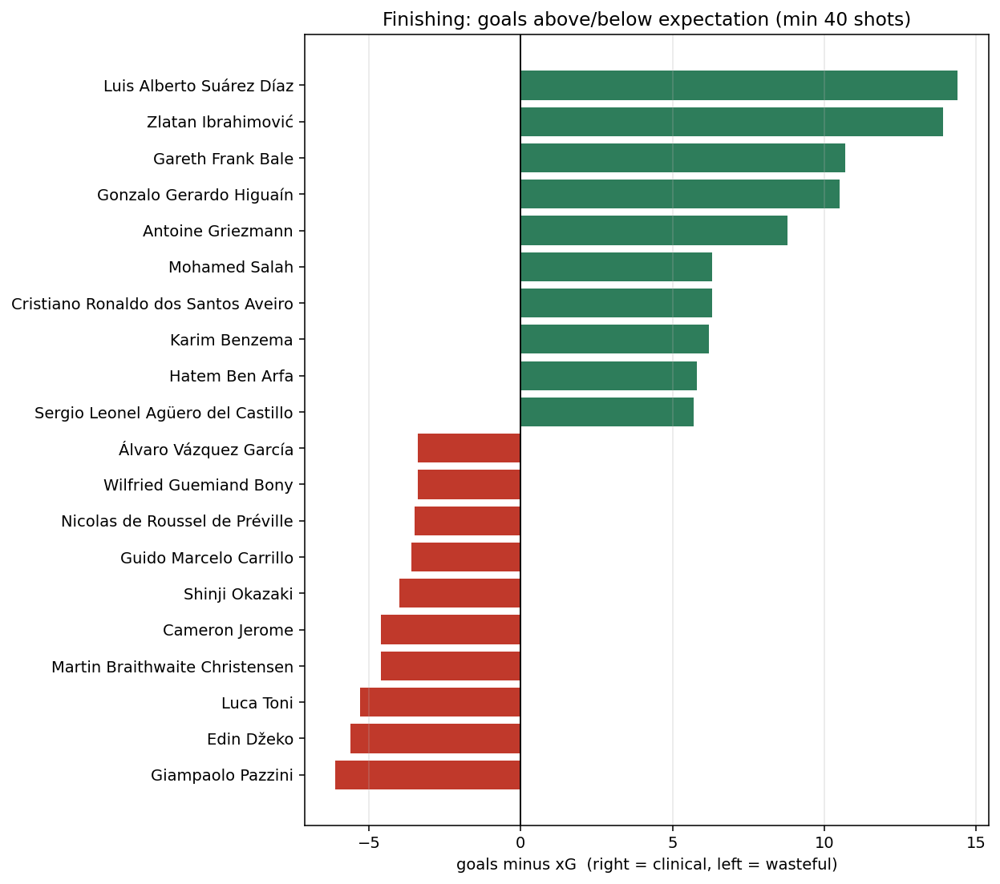
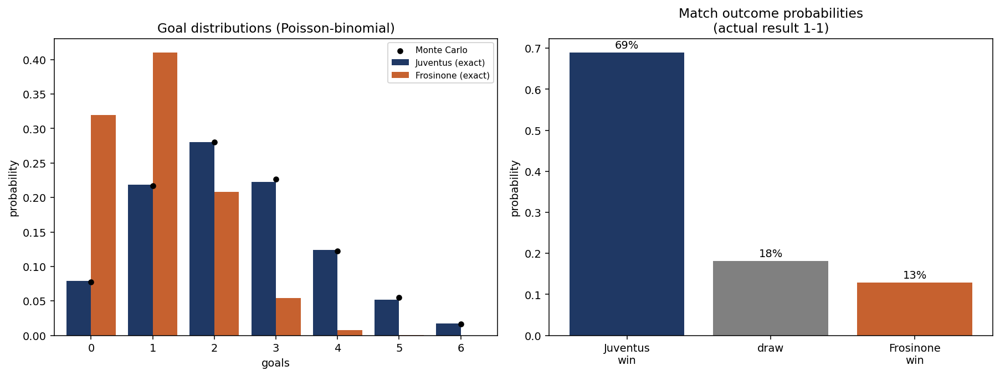
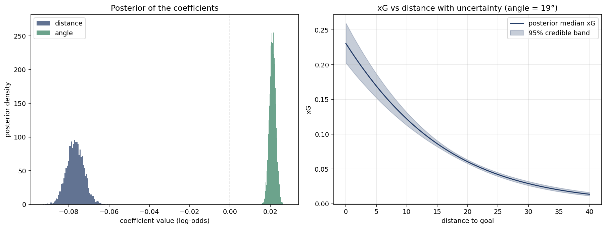
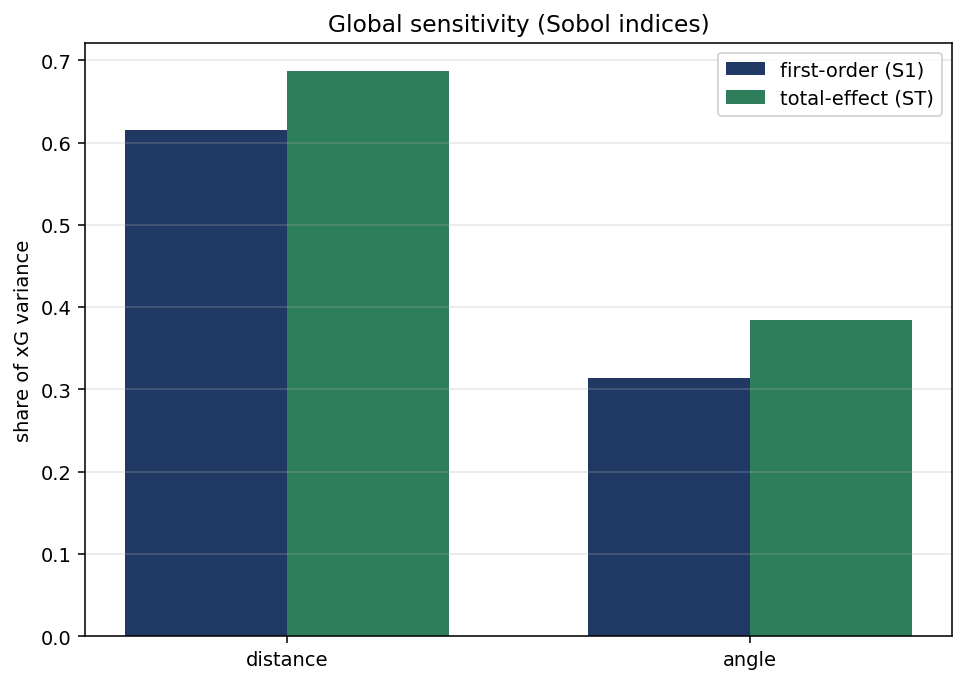

<div align="center">
  <h1>Expected Goals (xG) Modelling in Football</h1>
</div>


Expected Goals (xG) is the standard way football analysts quantify chance quality: the probability that a given shot results in a goal, based on where and how it was taken. This project builds a calibrated xG model from scratch as a **mathematical modelling** exercise — treating shot geometry, maximum likelihood estimation, model calibration, match simulation, and uncertainty as mathematical objects to derive and justify, not just a predictive pipeline to run.

## Table of Contents

1. [Abstract](#abstract)
2. [Project Description](#project-description)
   - [Key Components](#key-components)
   - [Model Progression](#model-progression)
   - [Project Goals](#project-goals)
3. [Data Scope](#data-scope)
4. [Project Structure](#project-structure)
5. [Installation](#installation)
   - [Prerequisites](#prerequisites)
   - [Steps for Installation](#steps-for-installation)
6. [Running the Pipeline](#running-the-pipeline)
7. [Results](#results)
   - [Key Metrics](#key-metrics)
   - [Feature Importance](#feature-importance)
   - [Applied Outputs](#applied-outputs)
8. [Extensions](#extensions)
9. [Report](#report)
10. [Future Work](#future-work)
11. [Contributing](#contributing)
12. [License](#license)
13. [Contact](#contact)
14. [Credits](#credits)

## Abstract

Expected Goals models are widely used in football analytics, but most public implementations prioritise predictive accuracy over mathematical transparency. This project builds an xG model on StatsBomb's open shot-event data with an explicit emphasis on interpretability: shot distance and angle are derived from first principles via trigonometry, the baseline logistic regression is framed as a maximum likelihood estimation problem with interpretable log-odds coefficients, and every model is evaluated not just on discrimination (AUC-ROC) but on calibration (Brier score, Expected Calibration Error) against StatsBomb's own published xG as a benchmark. The project is extended beyond a standard classification task into a Monte Carlo match simulation, Bayesian uncertainty quantification, and global sensitivity analysis (Sobol indices), turning the model into a tool that can simulate outcomes and quantify its own confidence, not just classify shots.

## Project Description

### Key Components

- **Shot Geometry:** Distance and angle to goal derived explicitly via trigonometry from StatsBomb's (x, y) shot-location coordinates.
- **Baseline Logistic Regression:** An interpretable model on distance + angle only, framed as maximum likelihood estimation, with coefficients reported as log-odds and odds ratios.
- **Enhanced Logistic Regression:** Adds shot context — body part, technique, play pattern, pressure, first-time finish — as encoded categorical features.
- **Tree-Based Models:** Random Forest and XGBoost, compared against the logistic baselines on the same evaluation criteria.
- **Calibration:** Every model is evaluated with AUC-ROC, Brier score, and Expected Calibration Error, with calibration curves plotted against the diagonal.
- **Applied Outputs:** Pitch-space xG surfaces, shot maps coloured by xG, and a player finishing table (goals minus xG) to surface over/under-performing finishers.
- **Monte Carlo Match Simulation:** Simulated league tables from shot-level xG using a Poisson-binomial approach, benchmarked against actual final standings.
- **Bayesian Uncertainty Quantification:** Coefficient uncertainty for the baseline logistic model via a Stan implementation (with a Python demo fallback).
- **Sensitivity Analysis:** Local derivative-based and global Sobol sensitivity indices, quantifying how much distance and angle each drive predicted xG.

### Model Progression

1. **Baseline logistic regression** — distance + angle only, interpretable, derived as an MLE problem.
2. **Enhanced logistic regression** — adds categorical shot context.
3. **Random Forest** and **XGBoost** — trading interpretability for flexibility.
4. **Evaluation throughout** — AUC-ROC, Brier score, calibration (ECE), benchmarked against StatsBomb's own xG.
5. **Applied outputs** — pitch xG surfaces, shot maps, player finishing table.
6. **Extensions** — Monte Carlo match simulation, Bayesian uncertainty, Sobol sensitivity analysis.

### Project Goals

- Build an xG model where every step — geometry, model fit, calibration — is mathematically derivable and explainable, not a black box.
- Benchmark model choice (logistic vs. tree-based) against a real, published xG model (StatsBomb's) to isolate what drives the accuracy gap.
- Extend prediction into simulation and uncertainty quantification, treating the model as a mathematical object rather than an endpoint.

## Data Scope

StatsBomb's open data only has **one fully covered season** for any major domestic league — everything else is a partial, player-specific subset (heavily skewed toward Barcelona/Messi) that would bias a distance/angle model if included. This project therefore combines the four leagues with a complete **2015/16** season — **La Liga, Premier League, Serie A, and Ligue 1** — into a single dataset:

- **1,517 matches** across the four leagues
- **37,488 shots** after removing penalties (which are always taken from a fixed spot and would distort a distance/angle model)
- **3,569 goals** (9.5% conversion rate)

Data is accessed programmatically via the [`statsbombpy`](https://github.com/statsbomb/statsbombpy) library, StatsBomb's official Python wrapper around their open data.

## Project Structure

```plaintext
xg-modelling/
├── README.md                 # this file
├── requirements.txt          # pinned Python dependencies
├── .gitignore
├── run_pipeline.py                # runs the whole pipeline in order
├── run_stan.R                # optional: Bayesian model in Stan (RStudio)
├── scripts/                  # the numbered, reproducible pipeline (01-15)
├── stan/                     # Stan model file
├── data/                     # datasets (fixtures, raw + processed shots, predictions)
├── notebooks/                # optional exploratory notebooks
├── outputs/                  # figures, tables, and LaTeX derivation snippets
├── report/                   # final LaTeX report + its figures
└── literature_review/        # standalone literature review (docx / tex / pdf)
```

## Installation

### Prerequisites

Ensure you have the following installed:

- Python 3.10+
- pip (Python package installer)
- git

### Steps for Installation

1. **Clone the repository:**

   ```sh
   git clone https://github.com/ACM40960/projects-rishveed-vishesh.git
   cd projects-rishveed-vishesh
   ```

2. **Create a virtual environment:**

   ```sh
   python -m venv .venv
   ```

   - **On macOS/Linux:**
     ```sh
     source .venv/bin/activate
     ```
   - **On Windows:**
     ```sh
     .venv\Scripts\activate
     ```

3. **Install the dependencies:**

   ```sh
   pip install -r requirements.txt
   ```

## Running the Pipeline

Run everything at once (the first two steps download data from StatsBomb, so allow a few minutes):

```bash
python run_pipeline.py
```

Or run the scripts individually, in order, from the repo root:

| # | Script | Produces |
|---|--------|----------|
| 01 | `scripts/01_get_fixtures.py` | real match results (`data/fixtures.csv`) |
| 02 | `scripts/02_extract_clean.py` | all shots (`data/shots_2015_16_top4.csv`) |
| 03 | `scripts/03_geometry.py` | distance + angle features, geometry figures |
| 04 | `scripts/04_baseline_logit.py` (+`04b`) | baseline logistic model + figures |
| 05 | `scripts/05_baseline_eval.py` | AUC, Brier, calibration |
| 06 | `scripts/06_encode_features.py` (+`06b`) | encoded features (`data/model_features.csv`) |
| 07 | `scripts/07_enhanced_logit.py` (+`07b`) | enhanced logistic model |
| 08 | `scripts/08_random_forest.py` (+`08b`) | Random Forest |
| 09 | `scripts/09_xgboost.py` (+`09b`) | XGBoost |
| 10 | `scripts/10_comparison.py` | model comparison table + figure |
| 11 | `scripts/11_calibration.py` | calibration-correction check |
| 12 | `scripts/12_applied_outputs.py` | shot map, xG surface, finishing table |
| 13 | `scripts/13_match_simulation.py` (+`13b`) | Monte Carlo xG league tables |
| 14 | `scripts/14_bayesian_uq.py` | Bayesian uncertainty (Python demo) |
| 15 | `scripts/15_sensitivity.py` | local + global (Sobol) sensitivity |

Steps depend on earlier ones, so keep the order.

## Results

### Key Metrics

All models are evaluated on a held-out test split with AUC-ROC, Brier score, log loss, and Expected Calibration Error (ECE), benchmarked against StatsBomb's own published xG:

| Model | AUC | Brier | LogLoss | ECE |
|---|---|---|---|---|
| Baseline logit (distance + angle) | 0.746 | 0.0795 | 0.2803 | 0.0162 |
| Enhanced logit (+ context) | 0.777 | 0.0772 | 0.2702 | 0.0138 |
| Random Forest | 0.779 | 0.0769 | 0.2690 | 0.0126 |
| XGBoost | 0.779 | 0.0769 | 0.2688 | 0.0114 |
| **StatsBomb xG (benchmark)** | **0.816** | **0.0714** | **0.2510** | 0.0116 |

The enhanced logistic model, Random Forest, and XGBoost converge to essentially the same performance (~0.78 AUC) — model *family* stops mattering once context features are added. The residual gap to StatsBomb's own xG (~0.82 AUC) is best explained by missing defender and goalkeeper positioning data (freeze-frame data), which StatsBomb's model has access to and this one does not, rather than by model choice.

The baseline logistic regression coefficients are directly interpretable in log-odds terms:

| Feature | Coefficient (log-odds) | Odds Ratio |
|---|---|---|
| Distance | -0.0733 | 0.929 |
| Angle (degrees) | +0.0229 | 1.023 |

Each additional metre from goal multiplies the odds of scoring by ≈0.93 (a 7% decrease); each additional degree of shooting angle multiplies the odds by ≈1.02 (a 2% increase) — both statistically significant (p < 0.001).




### Feature Importance

Random Forest feature importances confirm that geometry dominates: distance and angle together account for roughly 79% of total importance, with shot context (header, first-time, pressure) making up the remainder.

| Feature | Importance |
|---|---|
| Distance | 0.395 |
| Angle | 0.392 |
| Header | 0.064 |
| First-time | 0.030 |
| Under pressure | 0.027 |



### Applied Outputs

**Shot map and xG surface** — every shot in the dataset plotted on a pitch, coloured by predicted xG, alongside a continuous xG surface across pitch coordinates:




**Player finishing table** — actual goals minus expected goals (xG), surfacing the biggest over-performers relative to shot quality across the four 2015/16 leagues:

| Player | Shots | Goals | xG | Goals − xG |
|---|---|---|---|---|
| Luis Suárez | 134 | 37 | 23.0 | +14.0 |
| Zlatan Ibrahimović | 142 | 31 | 17.2 | +13.8 |
| Gareth Bale | 81 | 19 | 8.2 | +10.8 |
| Gonzalo Higuaín | 179 | 33 | 22.3 | +10.7 |
| Antoine Griezmann | 90 | 21 | 11.9 | +9.1 |



## Extensions

Beyond the core classification task, the project extends the xG model into three mathematical applications:

- **Monte Carlo Match Simulation** (`13_match_simulation.py`): simulates match and league outcomes from shot-level xG using a Poisson-binomial model, producing simulated league tables comparable against actual final standings.

  

- **Bayesian Uncertainty Quantification** (`14_bayesian_uq.py`, `stan/xg_logistic.stan`): re-fits the baseline logistic model in a Bayesian framework to obtain full posterior uncertainty over the distance/angle coefficients, rather than point estimates alone.

  

- **Sensitivity Analysis** (`15_sensitivity.py`): local derivative-based sensitivity and global Sobol indices, quantifying how much of the variance in predicted xG is attributable to distance versus angle.

  

## Report

The final write-up, including full derivations (geometry, MLE, Bayesian, simulation, sensitivity), is in [`report/xG_Report.tex`](report/xG_Report.tex), with a pre-built PDF at [`report/xG_Report.pdf`](report/xG_Report.pdf). To rebuild it, upload the `.tex` file and its accompanying PNGs in `report/` to Overleaf, set the compiler to **pdfLaTeX**, and compile.

A standalone literature review is available in [`literature_review/`](literature_review/) as `.docx`, `.tex`, and `.pdf`.

## Future Work

- **Freeze-frame data:** incorporate defender and goalkeeper positioning (where available) to close the gap to StatsBomb's benchmark xG.
- **Additional seasons:** as StatsBomb releases further full-season open data, extend the training set beyond 2015/16 to test temporal generalisation.
- **Player- and team-level modelling:** condition xG on shooter identity or team playing style rather than treating all shots as exchangeable.
- **Live application:** wrap the trained model behind a simple interface for match-day xG tracking from live event feeds.

## Contributing

Contributions are welcome. If you'd like to improve this project, please fork the repository and submit a pull request. Contributions could include additional features, improved documentation, or bug fixes.

### Steps to Contribute

1. Fork the repository.
2. Create a new branch.
3. Make your changes.
4. Submit a pull request.

## License

This project is licensed under the MIT License. *(Add a `LICENSE` file to the repo root if one is not already present.)*

## Contact

For any questions or suggestions, please open an issue on this repository.

## Credits

This project was built by Rishveed Sali and Vishesh, for module ACM 40960 (Mathematical Modelling), University College Dublin, using [StatsBomb's open data](https://github.com/statsbomb/open-data).
